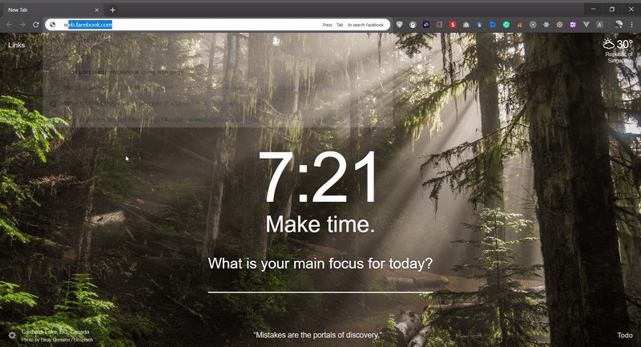

# SIM Library Chrome Extension

The chrome extension is available at Chrome Web Store.

## Summary
This chrome extension automatically reloads the eligible resource sites with the proxied access.
It currently supports:
- [SIM Library](https://library.sim.edu.sg) at http://libproxy.sim.edu.sg
- [University of London Online Library](https://onlinelibrary.london.ac.uk) (Coming up)
- [RMIT Library](https://rmit.edu.au/library) (Coming up)

Note - The extension is for intended use by SIM students and requires SIM library account for access.

## Background
SIM's operations with partnered universities have required students to maintain two sets of credentials for two different libraries in support of our academic pursuit. 

While it does sound more of a benefit to the general public, we often face frustration looking for the right resources for our paper writing across two digital libraries. 

This extension aims to assist the students with their academic endeavours.

## Options

## Author(s)
Phone Thant Ko <phonethantko@outlook.com>

## License
Copyright 2019, Phone Thant Ko

Released under the MIT License. See LICENSE for details.
